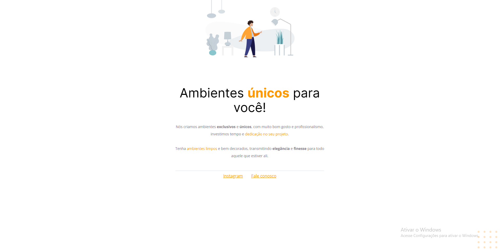

### Aplicação de webpage de empresa ficticia de decoração!!

<h1 align="center">
	Web page decoration
</h1>

Projeto desenvolvido durante o curso Explorer da <a href="https://www.rocketseat.com.br">Rocketseat</a>.  
Trata-se de uma landing page de uma empresa fictícia de decoração, construída utilizando conceitos básicos de HTML e CSS.  

## Overview

### Links

- URL do site: [Web page](https://webpage-html-css.vercel.app/)
- Figma do projeto: [Acesse](https://www.figma.com/file/lI8MSbICTKpDjGb1AYSSPF/Explorer---Projeto-01-(Copy)?node-id=0-1&t=aQLNwZWg05V1msCK-0)

### Desktop

 

 

 ## Contact Me

- [Linkedin](https://www.linkedin.com/in/rener-oliveira-cardoso-804039260/)

